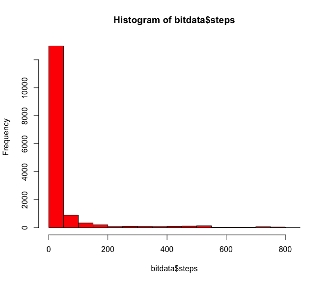
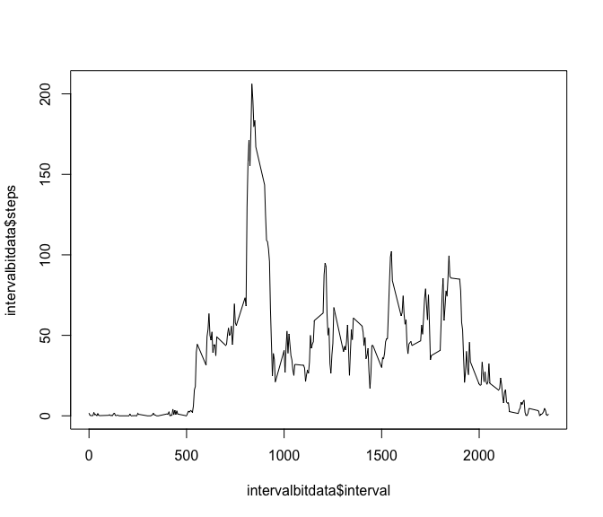
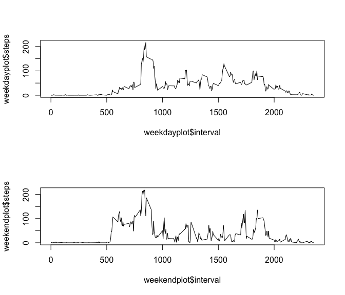

# Reproducible Research: Peer Assessment 1


## Loading and preprocessing the data

```r
bitdata <- read.csv("/Users/Sandeep/Documents/activity.csv", header=T)
head(bitdata)
```

```
##   steps       date interval
## 1    NA 2012-10-01        0
## 2    NA 2012-10-01        5
## 3    NA 2012-10-01       10
## 4    NA 2012-10-01       15
## 5    NA 2012-10-01       20
## 6    NA 2012-10-01       25
```

```r
tail(bitdata)
```

```
##       steps       date interval
## 17563    NA 2012-11-30     2330
## 17564    NA 2012-11-30     2335
## 17565    NA 2012-11-30     2340
## 17566    NA 2012-11-30     2345
## 17567    NA 2012-11-30     2350
## 17568    NA 2012-11-30     2355
```

```r
bitdata[600,]
```

```
##     steps       date interval
## 600     0 2012-10-03      155
```

## What is mean total number of steps taken per day?

```r
hist(bitdata$steps,col= "red")
```

\


```r
mean(bitdata$steps,na.rm="True")
```

```
## [1] 37.3826
```

```r
median(bitdata$steps,na.rm="True")
```

```
## [1] 0
```

## What is the average daily activity pattern?

```r
library(dplyr)
```

```
## 
## Attaching package: 'dplyr'
```

```
## The following objects are masked from 'package:stats':
## 
##     filter, lag
```

```
## The following objects are masked from 'package:base':
## 
##     intersect, setdiff, setequal, union
```

```r
interval <- group_by (bitdata,interval)
intervalbitdata <- summarize(interval,steps=mean(steps,na.rm="True"))
```

```r
plot(intervalbitdata$interval,intervalbitdata$steps,type="l")
```

\

## Find the interval with the most number of steps 

```r
arrangeintervalbitdata <- arrange(intervalbitdata,steps)
tail(arrangeintervalbitdata)
```

```
## Source: local data frame [6 x 2]
## 
##   interval    steps
##      (int)    (dbl)
## 1      820 171.1509
## 2      830 177.3019
## 3      845 179.5660
## 4      850 183.3962
## 5      840 195.9245
## 6      835 206.1698
```

```r
# The interval with the most number of steps is 835
```

## Imputing missing values

```r
count(bitdata[!complete.cases(bitdata),])
```

```
## Source: local data frame [1 x 1]
## 
##       n
##   (int)
## 1  2304
```

```r
#There are 2304 missing values. 
```


```r
zerobitdata <- bitdata
zerobitdata[is.na(zerobitdata)] <- 0
head(zerobitdata)
```

```
##   steps       date interval
## 1     0 2012-10-01        0
## 2     0 2012-10-01        5
## 3     0 2012-10-01       10
## 4     0 2012-10-01       15
## 5     0 2012-10-01       20
## 6     0 2012-10-01       25
```

```r
mean(zerobitdata$steps)
```

```
## [1] 32.47996
```

```r
median(zerobitdata$steps)
```

```
## [1] 0
```

```r
#These values differ from the original dataset. The impact is that the data will be incorrect, and the means / medians will be closer to the values inputted for the missing values. 
```

## Are there differences in activity patterns between weekdays and weekends?

```r
class(bitdata$date) <- "Date"
weekbitdata <- mutate (bitdata, day = weekdays(date, abbreviate = FALSE))
timebitdata <- weekbitdata  %>% mutate(time = ifelse(day == "Saturday", "Weekend", ifelse(day == "Sunday", "Weekend", "Weekday")))
```


```r
panelplotdata <- timebitdata %>% group_by (interval,time) %>% summarise(steps=mean(steps,na.rm="True"))
```


```r
class(panelplotdata$time)
```

```
## [1] "character"
```

```r
weekdayplot <- subset(panelplotdata,panelplotdata$time=="Weekday")
weekendplot <- subset(panelplotdata,panelplotdata$time=="Weekend")
```


```r
par(mfrow=c(2,1))
plot(weekdayplot$interval,weekdayplot$steps,type="l")
plot(weekendplot$interval,weekendplot$steps,type="l")
```

\

